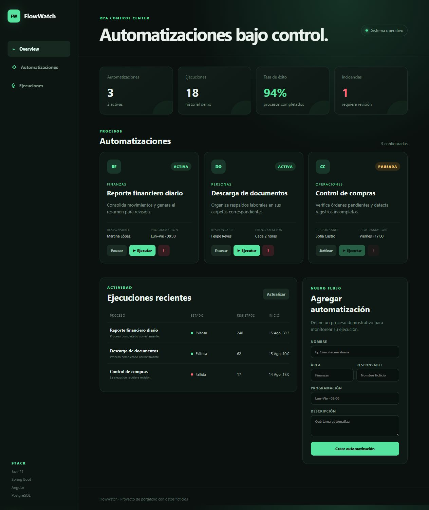

# FlowWatch

Panel de monitoreo de automatizaciones RPA que permite administrar procesos y simular sus ejecuciones. El proyecto muestra un flujo operativo simple, medible y completamente funcional para un portafolio full stack.



## Funcionalidades

- Panel con automatizaciones activas, ejecuciones, tasa de éxito y tiempo ahorrado.
- Registro de automatizaciones con área, responsable, horario y descripción.
- Activación y pausa de procesos.
- Simulación de ejecuciones exitosas o fallidas.
- Historial reciente con duración, resultado y detalle.
- Métricas recalculadas después de cada operación.
- Perfil PostgreSQL incluido para persistencia real.

## Tecnologías

- Java 21 y Spring Boot 3
- API REST, Spring Data JPA y validaciones
- Angular 22, TypeScript, HTML y SCSS
- PostgreSQL 17 para persistencia
- H2 en memoria para una demostración inmediata
- Maven, npm y Docker Compose

## Arquitectura

```text
Angular (localhost:4202)
        │ HTTP / JSON
        ▼
Spring Boot API (localhost:8082)
        │ JPA
        ▼
H2 local o PostgreSQL
```

## Ejecución rápida

Requisitos: Java 21, Maven, Node.js 22 o superior y npm.

1. Inicia la API:

   ```bash
   cd backend
   mvn spring-boot:run
   ```

2. En otra terminal, inicia Angular:

   ```bash
   cd frontend
   npm install
   npm start
   ```

3. Abre `http://localhost:4202`.

La configuración predeterminada usa H2 y carga información ficticia, por lo que puede probarse sin instalar una base de datos.

## Uso con PostgreSQL

```bash
docker compose up -d
cd backend
mvn spring-boot:run -Dspring-boot.run.profiles=postgres
```

PostgreSQL queda disponible en el puerto `5433`, lo que permite ejecutar FlowWatch junto con SupportDesk. Las variables `DATABASE_URL`, `DATABASE_USERNAME` y `DATABASE_PASSWORD` permiten reemplazar las credenciales locales.

## API REST

| Método | Ruta | Acción |
| --- | --- | --- |
| GET | `/api/dashboard` | Obtiene las métricas generales |
| GET | `/api/automations` | Lista las automatizaciones |
| POST | `/api/automations` | Crea una automatización |
| PATCH | `/api/automations/{id}/toggle` | Activa o pausa un proceso |
| POST | `/api/automations/{id}/run?outcome=SUCCESS` | Simula una ejecución |
| GET | `/api/runs` | Lista las ejecuciones recientes |

## Pruebas

```bash
cd backend
mvn test
```

El frontend también se valida con el compilador estricto de Angular y TypeScript.

## Autor

Desarrollado por [Pietro Alvarez](https://www.linkedin.com/in/pietro-antonello-francesco-alvarez-gazzola-33280438/).

Los nombres y registros incluidos son ficticios y se utilizan únicamente para demostración.
